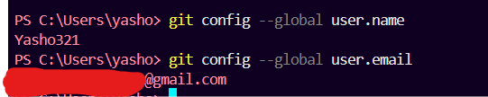

# Welcome to Your Git and GitHub Learning Adventure with ChaiCode Cohort!
# **Introduction** 
### Welcome to the Git and GitHub documentation for ChaiCode Cohort! This guide will help you master Git for version control and GitHub for seamless collaboration. These tools are essential for tracking changes, managing projects, and working with teams effectively. Let’s get started on building your developer skills!
# **Basics of Git and GitHub**
## **What is Git?**

### Git is a distributed version control system that allows developers to track changes in their codebase and collaborate efficiently. It provides a complete history of changes and enables safe experimentation through branching and merging.

## **Why Use Git?**
- **Version Control**: Keep a detailed history of your project.
- **Collaboration**: Work with teams without overwriting each other's work.
- **Backup**: Secure your code and recover previous versions.
- **Branching and Merging**: Test new features safely.
- **Efficiency**: Lightweight and fast, even for large projects.

## **GitHub Overview**

### GitHub is a **platform for hosting and managing code** using Git. It allows developers to collaborate on projects, track changes, and maintain code quality through features like pull requests, code reviews, and issue tracking.

## Importance in Team Collaboration

- **Centralized Codebase**: A single source of truth for all team members.
- **Seamless Collaboration**: Work together in real-time on the same project.
- **Efficient Workflow**: Manage tasks, review code, and track progress easily.

### GitHub simplifies development and fosters collaboration, making it essential for any team working on software projects.

# **Installation and Setup**

### This guide provides step-by-step instructions for installing Git on **Windows**, **macOS**, and **Linux**.

## **Installing Git on Windows**

1. **Download Git**  
   Visit [Git for Windows](https://git-scm.com/download/win) and download the installer.

2. **Run the Installer**  
   Open the downloaded `.exe` file and follow the prompts (choose default settings).

3. **Verify Installation**  
   Open **Git Bash** or **Command Prompt** and run:
   ```bash
   git --version


## **Installing Git on macOS and Linux**

1. **Download Git for macOS**  
   Visit [Git for macOS](https://git-scm.com/download/mac) and download the `.dmg` file.

   For **Linux**, you can install Git directly through your package manager.

2. **Install Git**  
   - For **macOS**, open the `.dmg` file and follow the installation steps.
   - For **Linux** (Debian/Ubuntu):
     ```bash
     sudo apt install git
     ```

     For **Fedora**:
     ```bash
     sudo dnf install git
     ```

     For **Arch**:
     ```bash
     sudo pacman -S git
     ```

3. **Verify Installation**  
   After installation, verify that Git is installed by running the following command in **Terminal**:
   ```bash
   git --version


## **Git Configuration Guide**

### **Setting Your Name and Email**
1. **Setting Name**
   ```bash
   git config --global user.name "Your Name"
2. **Setting Email**
   ```bash
   git config --global user.email "your_email@example.com"




## **How to Create a GitHub Account**

If you don't have a GitHub account yet, follow these steps to create one:

## Step 1: Visit GitHub

Go to the official GitHub website:  
[https://github.com](https://github.com)

## Step 2: Sign Up

- Click on the **Sign Up** button in the top-right corner of the page.
- Enter your **username**, **email address**, and choose a **password**.
- GitHub will ask you to solve a puzzle to verify you're not a robot.
- Click **Create account**.

## Step 3: Choose a Plan

GitHub offers free and paid plans. For most users, the **free plan** is sufficient. Select the free plan and continue.

## Step 4: Verify Your Email

GitHub will send a verification email to the address you provided.  
- Open your inbox and click the verification link to confirm your email address.

## Step 5: Set Up Your Profile

Once your email is verified, you can complete your profile by adding a photo, bio, and other details.

## Step 6: You're Ready!

After setting up your account, you can start using GitHub to host and manage your repositories, collaborate with others, and more!

---

# **Cloning the ChaiCode Repository**

Follow these steps to clone a GitHub repository to your local machine:

### Step 1: Copy the Repository URL

1. Go to the GitHub repository you want to clone (e.g., `https://github.com/username/repository-name`).
2. Click on the green **Code** button.
3. Copy the repository URL (either HTTPS or SSH, depending on your setup).

### Step 2: Open Your Terminal

- Open a terminal (or Git Bash on Windows).

### Step 3: Navigate to Your Desired Folder

Move to the folder where you want to clone the repository using the `cd` command. For example:

```bash
cd /path/to/your/folder
```

### Step 4: Clone the Repository
Run the following command, replacing <repository-URL> with the URL you copied in Step 1:

```bash
git clone <repository-URL>
```
### Step 5: Access the Repository
After the cloning is complete, navigate into the cloned repository folder:

```bash
cd repository-name
```
# **Basic Git Commands:**
## **Commonly Used Git Commands**

Here are some essential Git commands that you’ll frequently use while working on projects:

---

### **1. Check the Status of Your Repository**

Use `git status` to see the state of your working directory and staging area.

```bash
git status
```


### **2. Add Files to the Staging Area**

Use `git add` to stage files for the next commit. You can add specific files or us

```bash
git add <file-name>
```

To add all changes:

```bash
git add .
```


### **3. Commit Your Changes**
Commit your staged changes with a meaningful message using git commit:

```bash
git commit -m "Your commit message"
```


### **4. Push Changes to a Remote Repository**

Push your local commits to a remote repository using git push:

```bash
git push 
```
If you're working on a specific branch:

```bash
git push origin <branch-name>
```

### **5. Pull Changes from a Remote Repository**

To fetch and merge changes from the remote repository, use git pull:

```bash
git pull
```

This command keeps your local repository in sync with the remote.

### **6. View Commit History**
Use git log to see a list of all commits in your repository:

```bash
git log
```

Press q to exit the log view.

# **Commit Message Rules:**


Writing clear and standardized commit messages ensures that your project's history is easy to read and understand. Follow these rules when creating commit messages:

---

## **Rules for Writing Commit Messages**

1. **Use the Present Tense**
   - Describe what the commit does, not what you did.
   - ✅ Example: `Add user authentication`
   - ❌ Avoid: `Added user authentication`

2. **Capitalize the First Letter**
   - Always start the commit message with a capital letter.
   - ✅ Example: `Fix pagination issue`
   - ❌ Avoid: `fix pagination issue`

3. **Keep It Short and Concise**
   - Limit the subject line to **50 characters or less**.
   - If more detail is needed, add a body below the subject line.

4. **Use Categorization Prefixes**
   - Begin the message with a prefix to categorize the change:
     - `feat:` for new features
     - `fix:` for bug fixes
     - `docs:` for documentation updates
     - `chore:` for non-functional tasks (e.g., build updates)
     - `test:` for adding or updating tests
     - `refactor:` for code changes that neither fix a bug nor add a feature

   - ✅ Examples:
     ```bash
     feat: Add tea selection feature
     fix: Resolve login issue for tea enthusiasts
     docs: Update README with chai varieties
     ```

5. **Optional Body for Details**
   - If the subject line isn't enough, add a body explaining **what** and **why**.
   - Separate the subject line and body with a blank line.
   - Example:
     ```bash
     feat: Add tea selection feature

     Users can now select their favorite tea type during checkout.
     This feature improves personalization and enhances user experience.
     ```

6. **Avoid Unnecessary Words**
   - Skip words like "Fixing" or "Working on"—be direct and to the point.
   - ✅ Example: `fix: Resolve payment gateway error`
   - ❌ Avoid: `Fixing the issue with the payment gateway`

---

## **Examples of Standardized Commit Messages**

- **Feature Addition:**
  ```bash
  feat: Implement dark mode toggle
  ```

# **Branching Workflow:**

To maintain an organized workflow, we follow a simple and effective branching strategy. This ensures that all contributors can work simultaneously without overwriting each other's changes.

---

## **Branching Strategy**

1. **`main` Branch**
   - The primary branch that always contains the **stable production-ready code**.
   - Direct commits to the `main` branch are **not allowed**.

2. **`development` Branch**
   - The branch where the latest **integrated changes** are tested before merging into `main`.
   - All feature branches are merged into `development` after review.

3. **Feature Branches**
   - Created for individual features, bug fixes, or tasks.
   - Named descriptively, e.g., `feature/tea-menu` or `fix/login-issue`.

---

## **Creating and Switching Branches**

To create and switch to a new branch:

```bash
# Create a new branch
git branch feature/tea-menu

# Switch to the new branch
git checkout feature/tea-menu

# Alternatively, create and switch in one step
git checkout -b feature/tea-menu

#Verify the branch you’re on with:
git branch
```

---   

## **Merging Branches**
When your feature is complete and reviewed, merge it into development:

### Switch to the development branch:

```bash
git checkout development
```

### Merge the feature branch:

```bash
git merge feature/tea-menu
```
---
## **Resolving Merge Conflicts**
If there are conflicts during merging, follow these steps:

1. Git will highlight the files with conflicts. Open the conflicting files, and look for conflict markers like this:

```bash
<<<<<<< HEAD
// Code from the current branch
=======
// Code from the branch being merged
>>>>>>> feature/tea-menu
```
2. Manually edit the file to resolve the conflict, keeping the desired code.

3.Once resolved, mark the file as resolved:

```bash
git add <file-name>
``` 
4. Commit the merge with a meaningful message:

```bash
git commit
```

# **Pull Requests (PR)**

Pull Requests (PRs) allow you to propose changes to a repository and collaborate with others on code reviews.

---

## **Steps to Create a Pull Request**

### Step 1: Push Your Changes
Ensure your changes are pushed to the appropriate branch on GitHub:
```bash
git push origin <branch-name>
```

### Step 2: Navigate to the Repository
   -Go to the repository on GitHub.
   -Click the Pull Requests tab.

### Step 3: Open a New Pull Request
   -Click New Pull Request.
   -Choose the base branch (e.g., main or development) and the compare branch (your branch).

### Step 4: Review the Changes
   -GitHub will show the changes you’re proposing.
   -Verify everything is correct.
   -If you need to make changes, go back to your local repository, make the changes,

### Step 5: Add a Title and Description
   -Title: Summarize the changes in a short, clear statement.
      Example: feat: Add tea selection feature
   -Description: Provide more details, including:
      What the change does.
      Why it’s necessary.
      Any dependencies or related issues.
   -Example:
      ```markdown
      
      ### Summary
      - Added a dropdown menu for users to select their favorite tea type.
      - Improved user experience by personalizing checkout.

      ### Issue Resolved
      Closes #12

      ### Dependencies
      None

### Step 6: Request a Code Review
   -Add reviewers from the right-hand panel.
   -Optionally, add labels, assign the PR, or link it to issues.

### Step 7: Create the Pull Request
   Click Create Pull Request to submit your changes.

---

## **Guidelines for Writing PR Descriptions**

1.Use a clear and concise title.
   -**Example**: fix: Resolve payment gateway timeout issue

2.Structure the description with headings like:

   -**Summary**: What this PR does.
   -**Issue Resolved**: Reference linked issues (e.g., Closes #123).
   -**Dependencies**: Mention any related PRs or library updates.

3.Be specific about the why behind the change.

4.Keep it professional and polite.

---

# **Best Practices for Git Workflow**

## **1. Importance of Regular Commits**
Regular commits are crucial to maintaining a clean and manageable code history. Here’s why:
- **Track Progress**: Committing regularly allows you to track your work and see the evolution of your code over time.
- **Easy Rollback**: Smaller, frequent commits make it easier to revert changes if something goes wrong.
- **Collaboration**: When working with others, regular commits ensure that everyone is on the same page and reduces the chances of conflicts.

### Best Practices:
- Commit often, ideally after completing each feature or task.
- Avoid waiting too long to commit. This ensures your changes are easier to manage and troubleshoot.

---

## **2. Descriptive Commit Messages**
Clear and descriptive commit messages are essential for understanding the purpose of each change. Here’s how to write effective commit messages:

- **Use the present tense**: Example: `Fix typo in README` (not `Fixed typo in README`).
- **Keep it concise but informative**: Try to summarize the change in 50 characters or less. If more details are necessary, add them in the body of the commit message.
- **Categorize commits**: Use prefixes such as:
  - `feat:` for new features
  - `fix:` for bug fixes
  - `docs:` for documentation changes
  - `chore:` for routine maintenance
- **Avoid vague messages**: Instead of `Update code`, say something like `Add error handling to user login`.

### Example:
```bash
feat: Implement dark mode toggle feature
fix: Resolve login issue on mobile devices
docs: Update README with new setup instructions
```
---
## **3. Pull Updates Regularly to Avoid Conflicts**

Pulling updates frequently is essential to keep your local repository in sync with the remote repository, especially when working with a team. Here’s why:

- **Stay Updated**: Pulling updates ensures that you are working with the latest changes made by your team.
- **Avoid Conflicts**: If you don't pull frequently, you may encounter merge conflicts later. Regular pulls help minimize these conflicts.
- **Smooth Collaboration**: By pulling often, you ensure that your changes are always compatible with others’ work, making collaboration smoother.
- **Best Practices**:
   - **Pull before starting work**: Always pull the latest changes before you start your day or begin working on a new feature.
   - **Pull before committing**: If you're unsure about conflicts, pull and resolve any issues before committing your changes.
   - **Use git pull regularly**: It’s a good practice to pull at least once every day or before every major change.
   ```bash
   git pull origin main
   ```
By following these practices, you'll maintain a cleaner history, ensure smoother collaboration, and reduce the chances of conflicts, making the development process more efficient.

With Git and GitHub, you now have the tools to collaborate effectively, track your progress, and bring your projects to life—happy coding!

---


